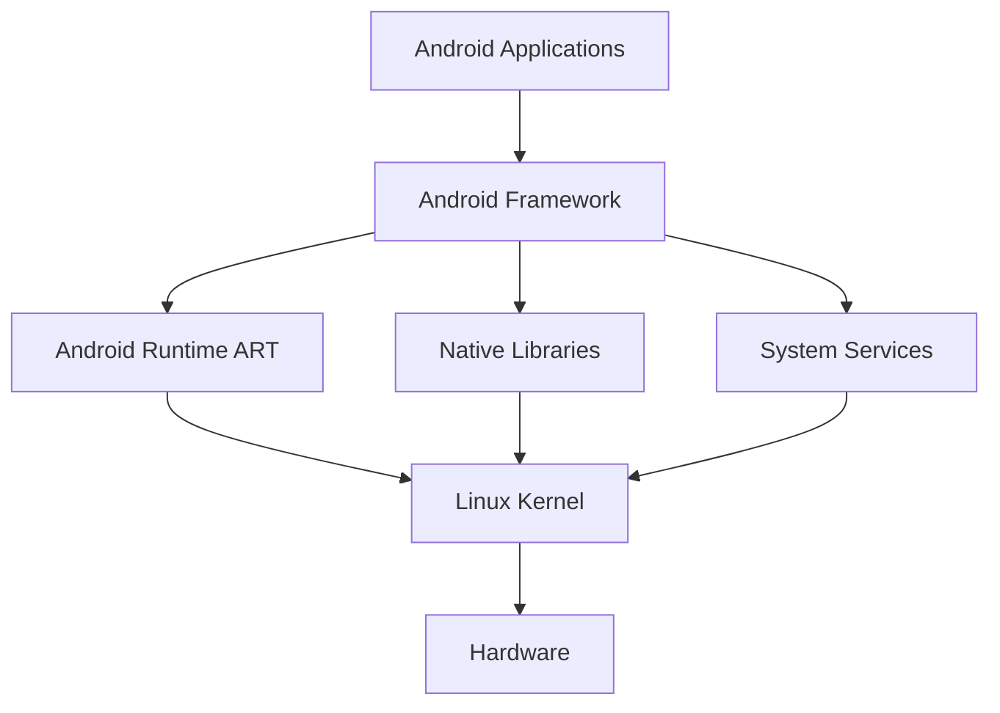
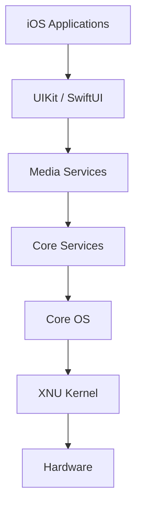
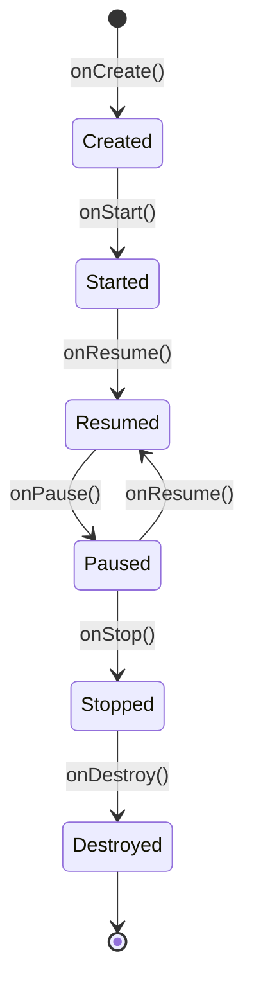

# Практична робота №1

## Загальний огляд мобільних платформ

**Дисципліна:** Програмування для мобільних платформ  
**Тема:** Архітектурне порівняння Android та iOS  
**Варіант:** 2

---

## 1. Мета роботи

Дослідити архітектуру Android та iOS, порівняти основні рівні операційних систем і розглянути життєвий цикл екранів. Визначити, як ці відмінності впливають на роботу розробника.

---

# 2. Загальний огляд платформ

Android та iOS - це дві основні мобільні операційні системи.

Android працює на основі ядра Linux. Платформа має відкриту архітектуру та підтримує велику кількість різних пристроїв.

iOS розроблена компанією Apple. Вона використовує ядро XNU та тісно інтегрована з апаратним забезпеченням Apple.

Обидві системи мають багаторівневу будову. Нижні рівні працюють з обладнанням, а верхні забезпечують роботу мобільних застосунків.

---

# 3. Порівняння архітектури Android та iOS

| Рівень | Android | iOS |
|---|---|---|
| Апаратне забезпечення | Процесор, камера, GPS, датчики | Процесор Apple, камера, GPS, датчики |
| Ядро | Linux Kernel | XNU Kernel |
| Системні бібліотеки | C/C++ Libraries | Core Foundation, Foundation |
| Середовище виконання | Android Runtime (ART) | Swift/Objective-C Runtime |
| Фреймворки | Android SDK, Jetpack Compose | UIKit, SwiftUI |
| Застосунки | Kotlin або Java | Swift або Objective-C |

### Android

Основні компоненти Android:

- Linux Kernel відповідає за процеси, пам'ять і драйвери.
- Hardware Abstraction Layer забезпечує доступ до обладнання.
- Android Runtime виконує програми.
- Android Framework надає готові API для розробника.
- Applications є кінцевими мобільними програмами.

### iOS

Основні компоненти iOS:

- Core OS містить базові системні функції.
- Core Services надає системні сервіси.
- Media відповідає за графіку, звук і відео.
- UIKit та SwiftUI використовуються для створення інтерфейсу.
- Applications є готовими програмами користувача.

---

# 4. Архітектура Android

Android використовує багаторівневу структуру. Застосунки працюють через фреймворки та системні бібліотеки, які в кінцевому результаті взаємодіють з ядром Linux.

---

# 5. Архітектура iOS

В iOS застосунки використовують системні фреймворки Apple. Нижні рівні відповідають за роботу операційної системи та обладнання.

---

# 6. Життєвий цикл екрана

Життєвий цикл визначає, що відбувається із застосунком під час запуску, роботи, згортання та повторного відкриття.

| Подія | Android Activity | iOS |
|---|---|---|
| Створення | `onCreate()` | `viewDidLoad()` |
| Поява на екрані | `onStart()` | `viewWillAppear()` |
| Активна робота | `onResume()` | Active |
| Втрата фокусу | `onPause()` | Inactive |
| Фоновий режим | `onStop()` | Background |
| Знищення | `onDestroy()` | Disconnect / Deinitialization |

## Життєвий цикл Android

Activity може бути знищена системою, наприклад після повороту екрана. Тому важливі дані потрібно зберігати поза Activity.

В iOS застосунок може переходити між станами Active, Inactive та Background. Розробник повинен правильно обробляти ці переходи, щоб не втрачати дані.

---

# 7. Помилки при ігноруванні життєвого циклу

| Помилка | Наслідок |
|---|---|
| Не зберігати дані | Втрата введеної інформації |
| Не зупиняти ресурси | Зайве використання пам'яті та батареї |
| Повторно створювати об'єкти | Повільна робота програми |
| Неправильно обробляти переходи | Зависання або аварійне завершення |

---

# 8. Практичні наслідки для розробника

### 1. Збереження стану

Android може знищити Activity під час зміни конфігурації. Для збереження даних використовують ViewModel або SavedState.

В iOS необхідно зберігати важливу інформацію під час переходу застосунку у фоновий режим.

### 2. Фонові процеси

Android має Service та WorkManager для фонових задач.

iOS сильніше контролює фонову роботу застосунків і використовує Background Tasks.

### 3. Інструменти розробки

Android використовує Kotlin та Android Studio.

iOS використовує Swift та Xcode.

Це означає, що розробка для двох платформ потребує знання різних API та інструментів.

---

# 9. Висновок

Android та iOS мають схожу багаторівневу архітектуру, але використовують різні ядра, фреймворки та моделі життєвого циклу.

**Для навчання та першої мобільної розробки обираю Android.**

Основні аргументи:

1. Android Studio та Kotlin мають велику кількість навчальних матеріалів.
2. Android підтримує багато різних пристроїв, що дозволяє краще зрозуміти принципи мобільної розробки.
3. Платформа має відкритішу екосистему та зручна для експериментів.

Основний ризик - велика кількість пристроїв і версій Android ускладнює тестування.

Отже, Android є зручним вибором для початківця завдяки доступності інструментів, гнучкості та широким можливостям для навчання.

---

# Джерела

1. Android Developers. **Platform architecture**.  
   https://developer.android.com/guide/platform/  
   Дата звернення: 13.09.2026.

2. Android Developers. **The activity lifecycle**.  
   https://developer.android.com/guide/components/activities/activity-lifecycle  
   Дата звернення: 13.09.2026.

3. Android Developers. **Processes and app lifecycle**.  
   https://developer.android.com/guide/components/activities/process-lifecycle  
   Дата звернення: 13.09.2026.

4. Apple Developer Documentation. **Technology Overviews**.  
   https://developer.apple.com/documentation/TechnologyOverviews  
   Дата звернення: 13.09.2026.

5. Apple Developer Documentation. **Managing your app's life cycle**.  
   https://developer.apple.com/documentation/uikit/managing-your-app-s-life-cycle  
   Дата звернення: 13.09.2026.

6. Apple Developer. **Develop for iOS**.  
   https://developer.apple.com/ios/  
   Дата звернення: 13.09.2026.