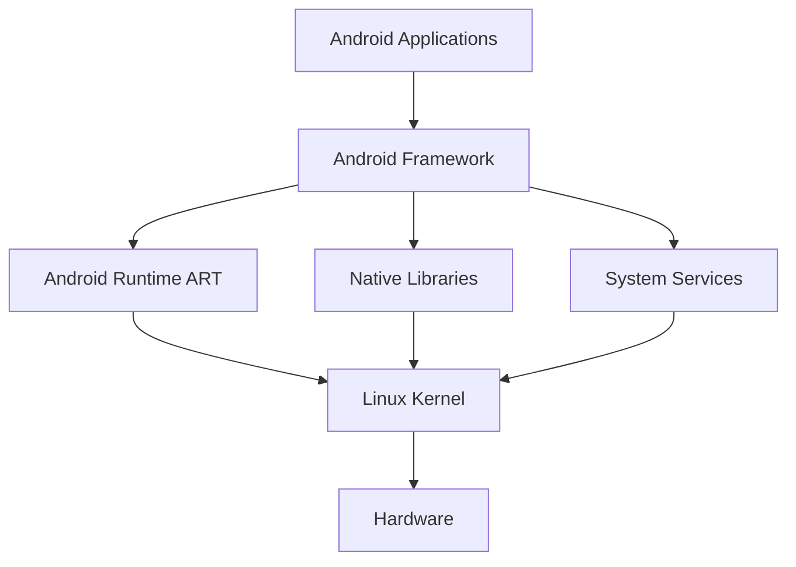
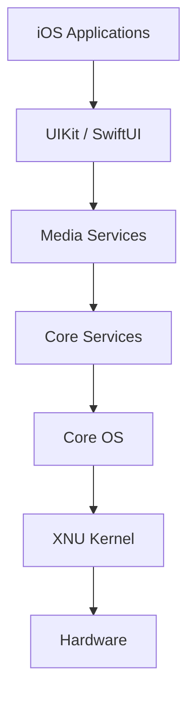

# Практична робота №1

## Загальний огляд мобільних платформ

**Дисципліна:** Програмування для мобільних платформ  
**Тема:** Архітектурне порівняння Android та iOS  
**Варіант:** 2

---

## 1. Мета роботи

Дослідити архітектуру Android та iOS, порівняти основні рівні операційних систем і розглянути життєвий цикл екранів. Визначити, як ці відмінності впливають на роботу розробника.

---

# 2. Загальний огляд платформ

Android та iOS - це дві основні мобільні операційні системи.

Android працює на основі ядра Linux. Платформа має відкриту архітектуру та підтримує велику кількість різних пристроїв.

iOS розроблена компанією Apple. Вона використовує ядро XNU та тісно інтегрована з апаратним забезпеченням Apple.

Обидві системи мають багаторівневу будову. Нижні рівні працюють з обладнанням, а верхні забезпечують роботу мобільних застосунків.

---

# 3. Порівняння архітектури Android та iOS

| Рівень | Android | iOS |
|---|---|---|
| Апаратне забезпечення | Процесор, камера, GPS, датчики | Процесор Apple, камера, GPS, датчики |
| Ядро | Linux Kernel | XNU Kernel |
| Системні бібліотеки | C/C++ Libraries | Core Foundation, Foundation |
| Середовище виконання | Android Runtime (ART) | Swift/Objective-C Runtime |
| Фреймворки | Android SDK, Jetpack Compose | UIKit, SwiftUI |
| Застосунки | Kotlin або Java | Swift або Objective-C |

### Android

Основні компоненти Android:

- Linux Kernel відповідає за процеси, пам'ять і драйвери.
- Hardware Abstraction Layer забезпечує доступ до обладнання.
- Android Runtime виконує програми.
- Android Framework надає готові API для розробника.
- Applications є кінцевими мобільними програмами.

### iOS

Основні компоненти iOS:

- Core OS містить базові системні функції.
- Core Services надає системні сервіси.
- Media відповідає за графіку, звук і відео.
- UIKit та SwiftUI використовуються для створення інтерфейсу.
- Applications є готовими програмами користувача.

---

# 4. Архітектура Android

Android використовує багаторівневу структуру. Застосунки працюють через фреймворки та системні бібліотеки, які в кінцевому результаті взаємодіють з ядром Linux.

---

# 5. Архітектура iOS

В iOS застосунки використовують системні фреймворки Apple. Нижні рівні відповідають за роботу операційної системи та обладнання.
